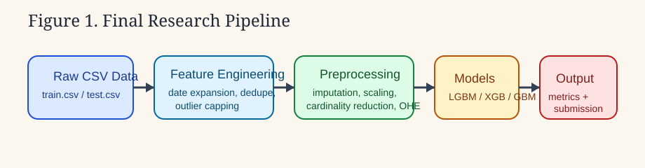
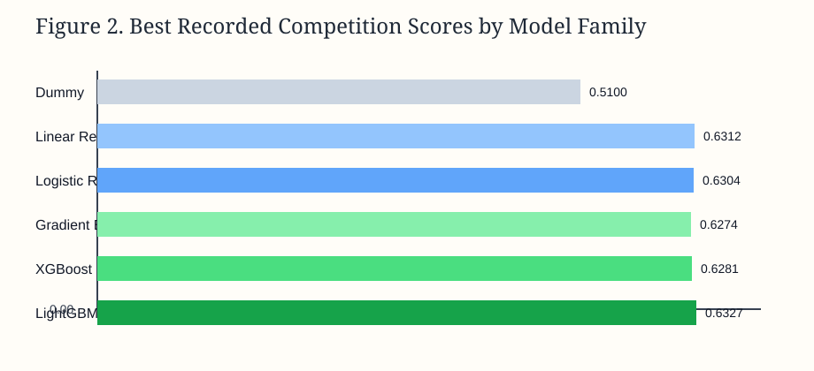
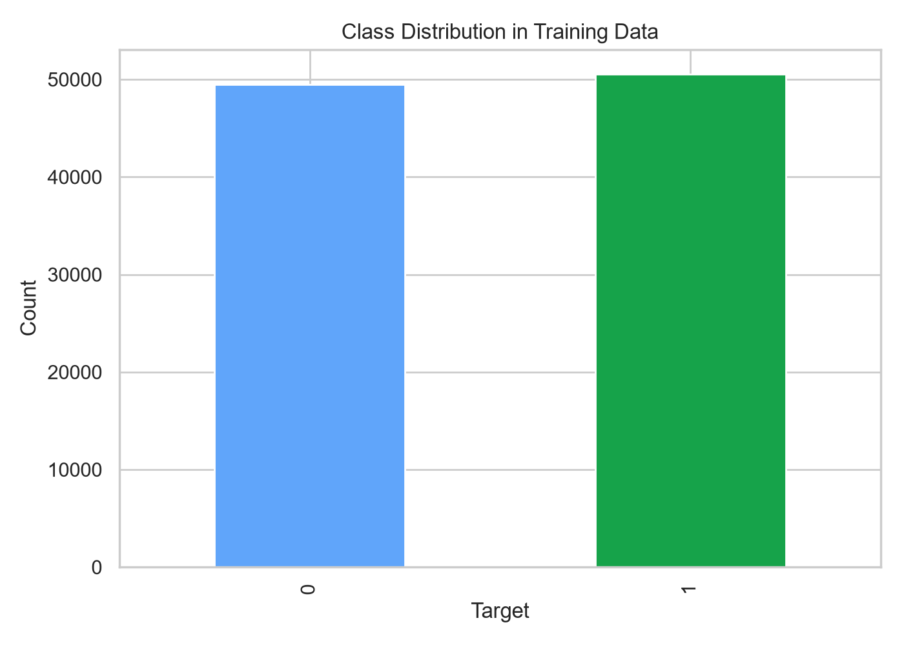
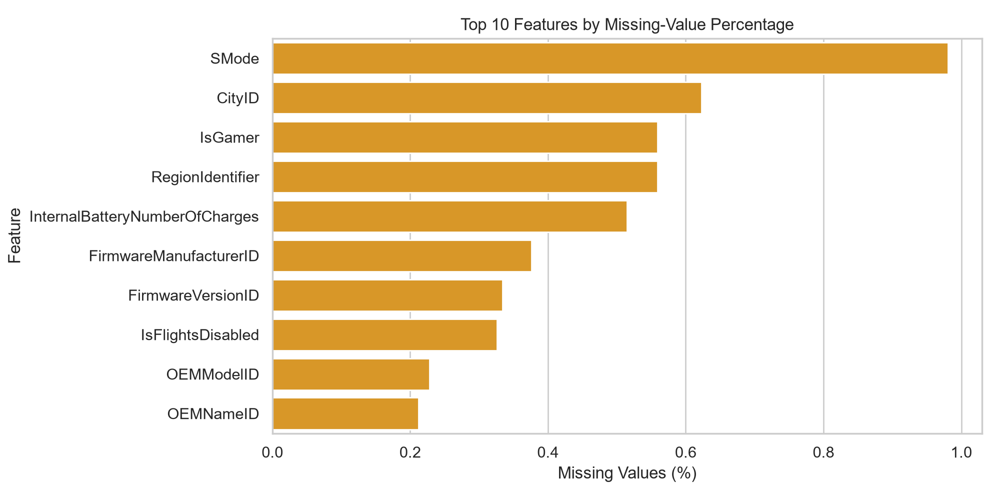
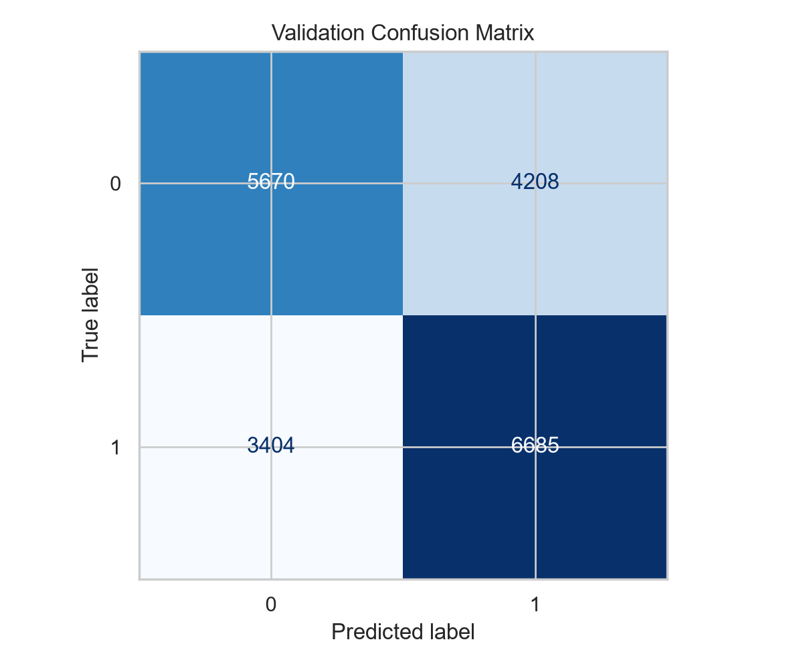
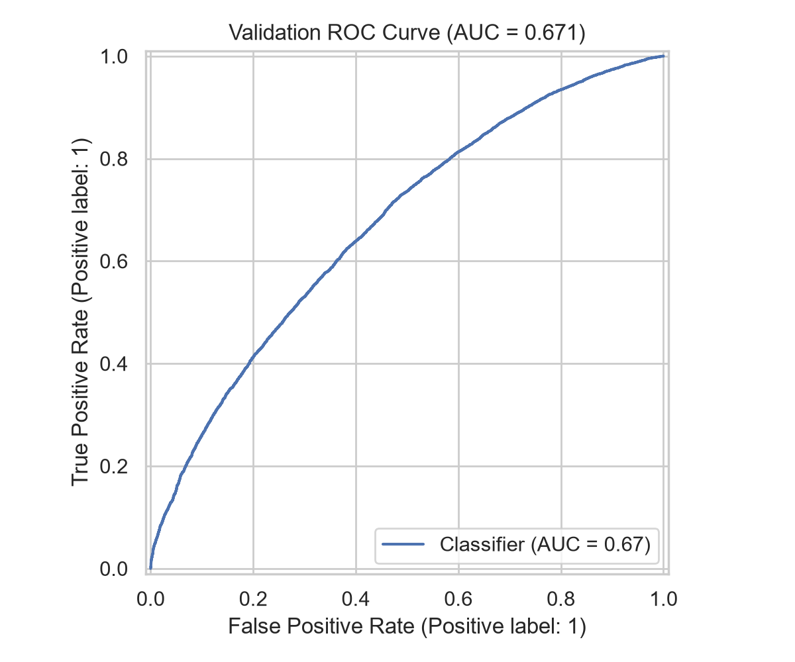
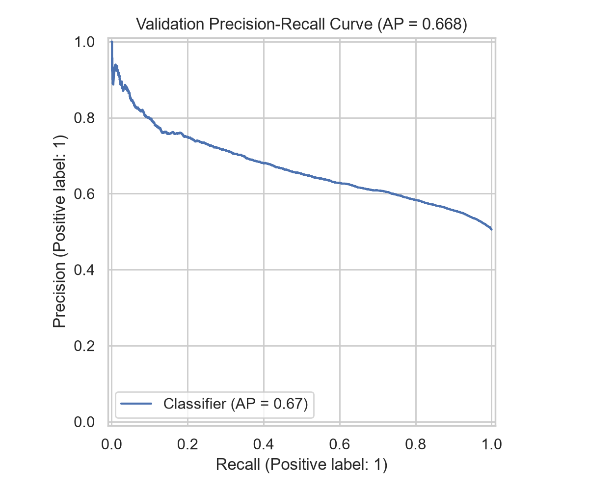

# System Threat Forecaster: An IEEE-Style Study of Tabular Malware-Risk Classification

## Abstract

This report presents a structured study of binary malware-risk classification for the Kaggle `System Threat Forecaster` competition. The task is to predict whether a system is likely to be infected using hardware, operating-system, security, and telemetry-derived attributes. The project evolved through 45 notebook iterations, beginning with dummy and linear baselines and progressing through support vector machines, neural networks, tree ensembles, hyperparameter search, and voting-based ensembles. The strongest recorded competition result was an accuracy of `0.63270`, achieved by a tuned `LightGBM` model in experiment `v37`. The final repository artifact is a cleaned notebook and a corresponding `src/` package that consolidates the main preprocessing and modeling workflow. The study shows that on heterogeneous tabular security data, disciplined preprocessing and tuned gradient-boosting methods outperform simpler baselines and most alternative models explored in the project.

## Index Terms

malware prediction, tabular classification, LightGBM, XGBoost, machine learning, cybersecurity analytics, Kaggle

## I. Introduction

Predictive modeling for endpoint security is a practical machine-learning problem with direct operational relevance. Systems generate diverse telemetry describing software state, hardware properties, update cadence, and security configurations. These signals can be used to estimate compromise risk before an infection event becomes observable. The `System Threat Forecaster` competition frames this problem as supervised binary classification.

This project studies that task using a notebook-driven experimental workflow and a refactored research codebase. The work is notable for two reasons. First, the dataset is strongly heterogeneous, combining numeric, binary, categorical, and date-derived variables. Second, model quality depends not only on classifier choice but also on preprocessing decisions such as missing-value handling, categorical encoding, duplicate removal, and temporal feature extraction.

The objective of this report is to document the technical evolution of the project in a formal research style and to identify the modeling decisions that produced the strongest results.

## II. Problem Definition

Let `X` denote system-level telemetry features and `y ∈ {0,1}` denote the binary infection target. The task is to learn a classifier `f(X) -> y` that generalizes to unseen systems in the competition test set. Performance is measured primarily by `accuracy`, as defined by the competition.

From a machine-learning perspective, the task has the following characteristics:

- mixed feature modalities
- moderate to high categorical cardinality
- missing values
- potentially nonlinear class boundaries
- possible interaction effects between operating-system, hardware, and update features

These characteristics make the problem well suited to a comparative study across linear, kernel, and ensemble-based methods.

## III. Dataset Characteristics

According to the final curated notebook, the raw training data contains `76` columns including the target, while the test set contains `75` columns. The features include:

- operating-system version and edition fields
- hardware and device-form descriptors
- antivirus and signature metadata
- binary security-state flags
- date fields such as `DateAS` and `DateOS`

The dataset therefore combines structured numeric fields with a large set of categorical attributes. Several fields also require engineering before they become useful to a downstream learner.

Table I summarizes the high-level data properties reflected in the final notebook and archive.

| Table I | Dataset and Experiment Summary |
|---|---|
| Training columns | `76` |
| Test columns | `75` |
| Retained notebook versions | `40` |
| Removed errored versions | `5` |
| Primary metric | `accuracy` |
| Best recorded score | `0.63270` |
| Best experiment | `v37` |

## IV. Research Objectives

The project addressed the following research questions:

1. Which preprocessing design is most effective for mixed tabular malware-risk data?
2. Do boosting-based ensemble methods outperform linear, kernel, and neural alternatives?
3. Does explicit feature engineering improve predictive performance?
4. Can the final workflow be simplified without losing the key lessons from the broader experiment history?

## V. Methodology

### A. Experimental Workflow

The project progressed through six phases:

1. baseline modeling with a dummy classifier
2. early classical pipelines using linear and logistic models
3. broad model exploration across many classifier families
4. SVC and encoding-focused refinements
5. systematic hyperparameter search for boosted ensembles
6. notebook cleanup and consolidation

The experiment archive contains 45 versioned notebooks, with 40 retained working versions and 5 removed errored versions.

Figure 1 summarizes the final consolidated workflow represented by both the final notebook and the new `src/` research package.

### B. Data Preprocessing

The final notebook applies a sequence of transformations before model fitting:

- parsing `DateAS` and `DateOS`
- imputing invalid or missing date values
- deriving elapsed-time and calendar features
- dropping low-information fields
- trimming whitespace from string values
- removing duplicate training rows
- analyzing and capping numeric outliers
- separating numeric and categorical columns
- reducing categorical cardinality by grouping rare values into `Others`
- imputing missing values with `SimpleImputer`
- encoding categorical features with `OneHotEncoder`
- scaling numeric features with `StandardScaler`

These steps reflect the central engineering conclusion of the project: preprocessing quality materially determines the competitiveness of even simple models.

### C. Feature Engineering

The most important explicit engineered features in the final notebook are derived from `DateAS` and `DateOS`:

- `Days_Between_os_as`
- `DateAS_Year`, `DateAS_Month`, `DateAS_Day`
- `DateOS_Year`, `DateOS_Month`, `DateOS_Day`
- `DaysSinceASUpdate`
- `DaysSinceOSUpdate`

These features encode update recency and temporal mismatch between operating-system and antivirus-related dates. Additional exploratory phases also tested principal component analysis, feature selection, label encoding, polynomial expansion, and class-balancing techniques.

### D. Candidate Models

Across the full experiment history, the following model families were explored:

- `DummyClassifier`
- `LinearRegression` used with thresholded outputs
- `LogisticRegression`
- `Ridge` and `Lasso` variants
- `RandomForestClassifier`
- `GradientBoostingClassifier`
- `XGBClassifier`
- `LGBMClassifier`
- `SVC`
- `SGDClassifier`
- `MLPClassifier`
- `KNeighborsClassifier`
- `DecisionTreeClassifier`
- `AdaBoostClassifier`
- `VotingClassifier`
- `StackingClassifier`
- exploratory `CatBoost` usage in later versions

### E. Hyperparameter Search

The most successful later-stage experiments relied on:

- `GridSearchCV`
- `RandomizedSearchCV`
- cross-validation with repeated model comparison

This was especially important for XGBoost, GradientBoosting, and LightGBM, where untuned initial runs underperformed later tuned configurations.

### F. Refactored Research Codebase

To move the project beyond a notebook-only state, the repository now includes a package-based structure:

- `src/system_threat_forecaster/config.py`: experiment configuration
- `src/system_threat_forecaster/data.py`: dataset loading and artifact directory setup
- `src/system_threat_forecaster/features.py`: date-feature engineering and row cleanup
- `src/system_threat_forecaster/preprocessing.py`: outlier capping, cardinality reduction, and column preprocessing
- `src/system_threat_forecaster/models.py`: model selection
- `src/system_threat_forecaster/train.py`: end-to-end experiment runner
- `scripts/train_model.py`: command-line training entrypoint

This structure maps the final notebook logic into reusable Python modules and makes further controlled experiments easier.

### G. Evaluation Metrics

The competition objective used `accuracy`, but internal evaluation also considered:

- `f1_score`
- `precision`
- `recall`
- `confusion_matrix`
- `classification_report`
- `roc_auc`
- cross-validation accuracy

These secondary metrics helped assess whether higher accuracy corresponded to better class-level behavior.

## VI. Experimental Results

### A. Baseline

The most-frequent dummy classifier in `v03` achieved approximately `0.51000` accuracy, establishing the effective lower bound for the task.

### B. Early Strong Baselines

Two early models were unexpectedly competitive:

- `v06`: `LinearRegression` with thresholding, `0.63116`
- `v07`: `LogisticRegression`, `0.63035`

These results indicate that a properly engineered preprocessing pipeline captured substantial signal even before advanced ensemble methods were introduced.

### C. Intermediate Exploration

Several mid-stage experiments produced modest or unstable gains:

- early `RandomForestClassifier`: about `0.61510`
- early `XGBClassifier`: about `0.61490`
- `MLPClassifier` submissions: near `0.60310`
- `SGDClassifier` submissions: near `0.52360`
- SVC with polynomial kernel: about `0.60160`

SVC with RBF kernel performed better than many alternatives, with `v17` reaching `0.61920`, but it still did not exceed the top boosting-based models.

### D. Best Recorded Results

| Table II | Best Recorded Competition Results |
|---|---:|
| `v37` tuned `LightGBM` | `0.63270` |
| `v41` voting ensemble (`LightGBM + XGBoost + CatBoost`) | `0.63070` |
| `v35` tuned `XGBoost` | `0.62810` |
| `v36` tuned `GradientBoosting` | `0.62740` |
| `v29` tuned `RandomForest` with feature engineering | `0.62400` |

Figure 2 compares the best recorded scores across key model families that emerged during the study.

The best observed competition score was therefore produced by a tuned LightGBM model rather than by a linear model, support vector machine, neural network, or voting ensemble.

### E. Local Reproduction Run

Using the current refactored LightGBM pipeline, the local validation accuracy was `0.6188`. The run also produced a trained pipeline artifact, a submission file, and evaluation metadata under `artifacts/`. This result is lower than the best archived leaderboard score, which is expected because the refactored pipeline is a cleaned reproducible baseline rather than a byte-for-byte recreation of the single strongest competition notebook.

Figures 3 through 7 summarize the local data profile and validation behavior of the refactored pipeline.

## VII. Discussion

### A. Why LightGBM Performed Best

The observed advantage of LightGBM is consistent with the structure of the data. The task includes nonlinear relationships, mixed feature types after encoding, and interactions that linear methods cannot represent directly. Gradient-boosting methods are well suited to such settings because they:

- capture nonlinear decision boundaries
- model interaction effects effectively
- remain strong on structured tabular data
- benefit from targeted hyperparameter tuning

The improvement from untuned tree ensembles to tuned boosting variants supports this interpretation.

### B. Importance of Preprocessing

One of the strongest findings from the project is that preprocessing quality mattered almost as much as model choice. The competitiveness of `v06` and `v07` demonstrates that:

- temporal features added useful signal
- handling mixed-type data correctly was essential
- categorical engineering and missing-value strategy strongly affected downstream performance

This result is important because it shows that strong baselines should be built carefully before pursuing more complex methods.

### C. Limited Gains from Some Complex Alternatives

Several more complex models did not outperform tuned boosting:

- MLP-based models underperformed on this structured dataset
- SGD-based models were too weak for the observed nonlinearities
- some ensembles added complexity without improving leaderboard score

This is a familiar pattern in tabular learning, where boosting methods often dominate unless feature representation is fundamentally changed.

### D. Engineering Maintainability

The later notebooks became large and difficult to audit, with some versions exceeding 100 code cells. The final cleanup phase was therefore an engineering improvement as well as a modeling consolidation. The new `src/` package addresses that issue directly by separating configuration, feature engineering, preprocessing, and training logic.

## VIII. Limitations

The study has several limitations:

- exact reruns require access to the Kaggle competition data
- some experiment conclusions depend on leaderboard feedback rather than a single frozen validation scheme
- not all candidate models were compared under identical preprocessing and search budgets
- the refactored codebase is derived from the final notebook and has not yet been benchmarked against every archived variant
- the project does not yet include automated experiment tracking

These limitations do not invalidate the findings, but they do constrain reproducibility and the strength of cross-experiment comparisons.

## IX. Conclusion

This work investigated binary malware-risk classification on heterogeneous system telemetry using a broad set of classical and modern machine-learning approaches. The main conclusion is that strong preprocessing and tuned gradient-boosting models provide the best performance for this dataset. Across 45 notebook iterations, the strongest recorded result was `0.63270`, achieved by tuned LightGBM in `v37`. The repository now preserves the outcome of that exploration in a cleaner, more maintainable research structure built around a curated final notebook, a reusable `src/` package, and supporting documentation.

## X. Future Work

The most valuable next steps are:

1. define a fixed validation split for cleaner model comparison
2. track experiments using explicit configuration and result logs
3. evaluate CatBoost systematically under the same protocol as LightGBM and XGBoost
4. add ablation studies for date features, outlier capping, and categorical reduction
5. export a final reproducible inference pipeline
6. add unit tests for preprocessing and feature-engineering functions

## References

[1] Kaggle, `System Threat Forecaster` competition.

[2] Repository notebook, `notebooks/system-threat-forecaster-final.ipynb`.

[3] Experiment summary, `docs/experiment-history.md`.

[4] Research code package, `src/system_threat_forecaster/`.
